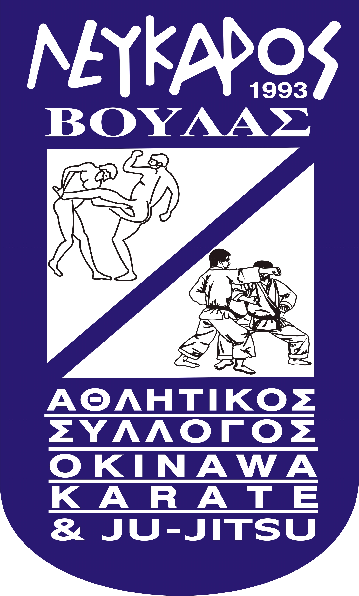



Ο Α.Σ Λεύκαρος Βούλας είναι __Πρωταθλητής Ελλάδος στο Ju-Jitsu από το 1997 έως σήμερα__ και δραστηριοποιείται __στο Ju Jitsu , το Okinawa Karate , το Παγκράτιο Άθλημα και το Krav Maga__.

Είμαστε ένα μη κερδοσκοπικό σωματείο και ενεργούμε υπό την αιγίδα της Ελληνικής Φιλάθλου Ερασιτεχνικής Ομοσπονδίας Ζίου Ζίτσου (Ε.Φ.Ε.Ο.Ζ.-Ζ.) που είναι αναγνωρισμένη από την Γενική Γραμματεία Αθλητισμού.

Το Διοικητικό Συμβούλιο του Συλλόγου αποτελείται από :

|                   |                          |
|-------------------|--------------------------|
|Πρόεδρος           |: Μαρκέτος Γεράσιμος      |
|Γενική Γραμματέας  |: Φαράκλα Μαρίκα          |
|Ταμίας             |: Ζερβός Γεράσιμος        |
|Α’ Αντιπρόεδρος    |: Ρέτσου Ιωάννα           |
|Β’ Αντιπρόεδρος    |: Αγγελιδάκη Σταματία     |
|Γενική Αρχηγός     |: Καραγιάννη Αικατερίνη   |
|Ειδική Γραμματέας  |: Πατζοπούλου Αικατερίνη  |

 

Μαζί με τους προπονητές του Συλλόγου __Go-5-dan Master Γιώργο Ζαντιώτη__ και __San-3-Dan Master Κώστα Καζάκο__ που όλα αυτά τα χρόνια εργάζονται ακούραστα δίπλα στους αθλητές μας, δεσμευόμαστε οι στόχοι του Λεύκαρου να επιτευχθούν στο έπακρο και να χαρίσουμε στον Σύλλογο μας ακόμα περισσότερες νίκες.